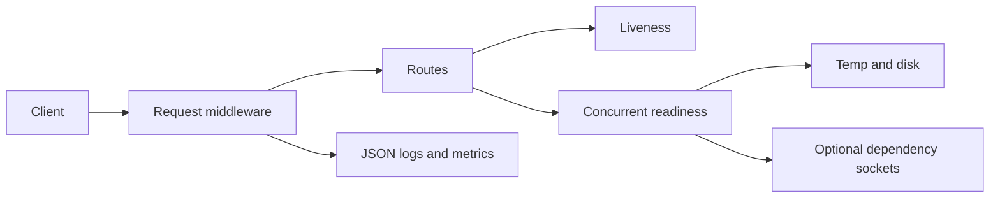

# Architecture

`create_app()` owns immutable settings, logging, metrics, and lifespan state.
Middleware establishes a safe request ID, normalizes unexpected failures, emits
bounded metrics, and writes one access event. Platform routes delegate readiness
to small async check functions.

This deliberately avoids a repository/service hierarchy: four small modules
provide enough separation for this service size.
